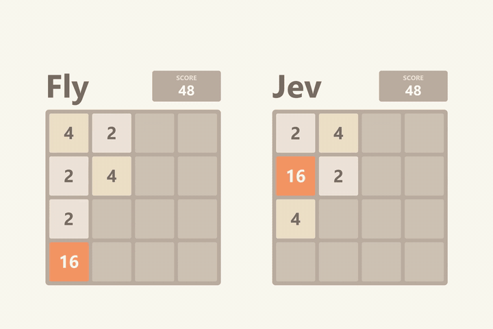
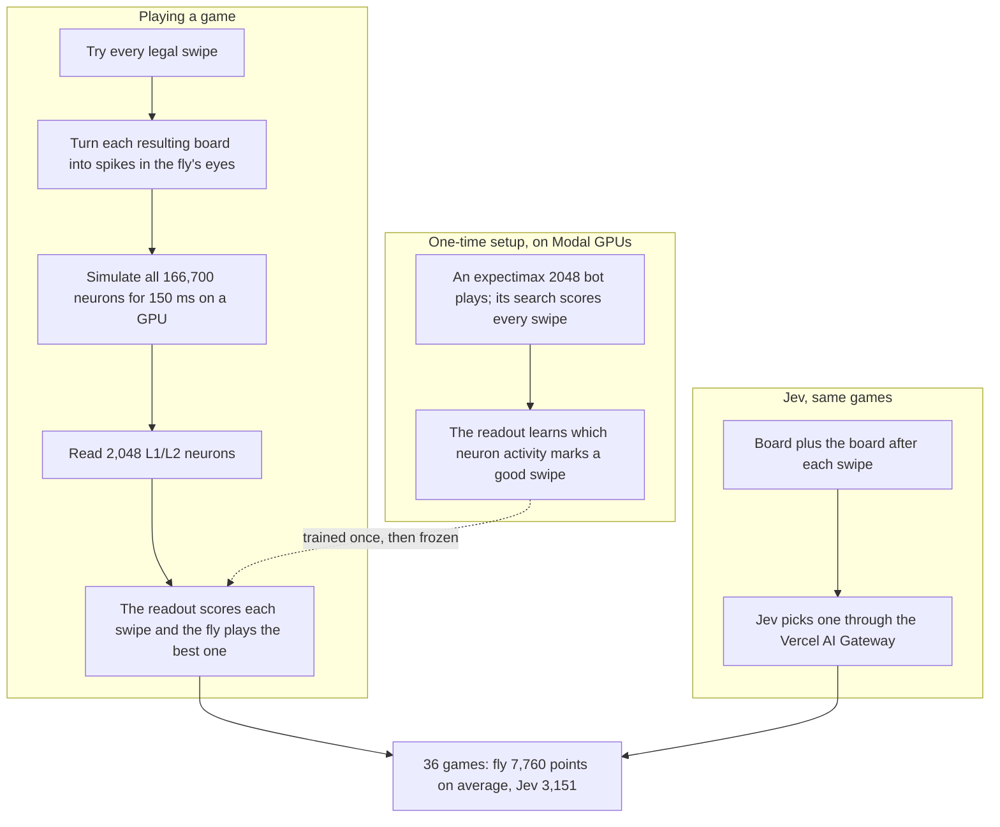
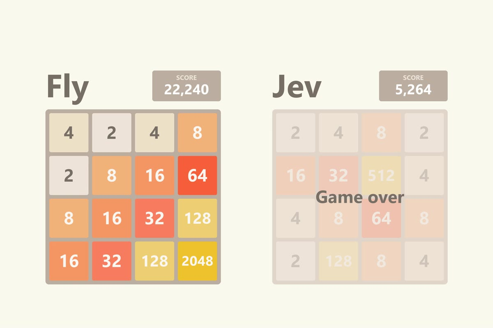

<h1 align="center">Fly vs Jev</h1>

<p align="center"><b>A simulated fruit fly brain against an AI model, at 2048.</b><br>
The full wiring of an adult fly, all 166,700 neurons, sees the board through its eyes and picks every swipe. TypeSafe AI's Jev plays the same games.</p>

<p align="center">
  
</p>

## How it works

1. **Eyes.** For each swipe the fly could make, the board it would leave behind becomes spikes in the fly's photoreceptors. Every row and column gives four numbers (empty cells, merges waiting, how ordered the line is, tile mass). The left eye sees the rows, the right eye the columns.
2. **Brain.** The MaleCNS connectome (166,700 neurons, 6.2 million connections) runs as a spiking network for 150 ms per candidate swipe. Its wiring is never changed. This is the same simulator as [Flytris](https://github.com/EnesYilmazcode/Flytris).
3. **Move.** A readout over 2,048 L1/L2 neurons scores each swipe and the fly plays the best one. The readout is the only part that learned: it learned once from an expert 2048 bot's judgments, then plays on its own.
4. **Jev.** Jev gets the rules, the board, and the board each legal swipe would leave, and picks one. It never trained on 2048.

Both players get the same 36 games: the same starting board and the same seeded random numbers for new tiles (where a new tile lands still depends on each player's board).

## System design

During a game the bot is never consulted: every fly move comes from simulated neurons and the readout on top. The bot only supplied examples once, during setup.



## Results

36 games, seeds 5000 to 5035. Every player faces the same games.

| | Avg score | Reached 512 | 1024 | 2048 |
|---|---:|---:|---:|---:|
| **The fly** | **7,760** | **25** | **7** | **1** |
| Jev | 3,151 | 8 | 0 | 0 |
| Random swipes | 1,211 | 0 | 0 | 0 |

The fly outscored Jev in 31 of the 36 games (sign test p = 0.00001). Its best game built a 2048 tile in 1,118 moves; that is the video.

The same readout wired straight to the eye inputs, with no brain in between, averaged 5,937. The fly's edge over it is not statistically clear (higher in 21 of 36 games), so the skill comes from the trained readout, not from the brain being smart on its own. What the brain is required for, the controls show: break one part of the pathway and play collapses.

| Control, 16 games | Avg score | Best tile |
|---|---:|---:|
| Intact fly, same 16 games | 8,187 | 1024 |
| Readout silenced | 652 | 128 |
| Readout weights shuffled | 586 | 256 |
| Eye wiring shuffled | 248 | 64 |

All three controls land below random swiping.

Jev with beginner strategy added to its prompt (keep the biggest tile in a corner, keep rows ordered) did not do better: 2,576 over 8 games.

## What made the fly work

- **A target a one-look player can learn.** The fly judges each swipe with a single look, while the bot searches several moves ahead. Training the readout on one layer of lookahead (the average over every tile that could appear next) worked better than training it on the bot's deep search. In a no-brain test on the eye inputs over 16 games, that change took the average from 2,966 to 4,747.
- **Show the result, not the transition.** In the same test, showing only the board after the swipe beat showing the board before and then after.
- **For scale:** the bot's own board heuristic, used with no lookahead at all, averages 5,958. The fly's 7,760 beats it.

The readout matches the lookahead's favourite swipe 62.3% of the time on held-out bot games, against 27.9% for picking at random. See [`results/gate.json`](results/gate.json).

## The video

Both players replay a saved game on seed 5033, move for move, checked against the game engine after every move. The pace starts slow, speeds up, fast-forwards once Jev is out, and slows down for the fly's 2048 merge. The sound is synthesized: a soft tick per swipe, pentatonic chimes on merges, a chord for the 2048 tile.

<p align="center"></p>

## Run it

```bash
pip install numpy numba pandas pyarrow torch pillow modal
python tests/test_game.py                       # engine and teacher checks
python scripts/teacher_games.py 0 3             # the expectimax bot: 8192, 2048, 16384 on these seeds
modal run scripts/modal_fly2048.py::build_readout
modal run scripts/modal_fly2048.py::fly_games --first 5000 --last 5036
AI_GATEWAY_API_KEY=... python scripts/jev_games.py 5000 5036 4 rules
python scripts/scoreboard.py 5000 5036
python video/render2048.py 5033                 # needs ffmpeg
```

The connectome comes from the Flytris repo's `data/malecns` (built by its `data/malecns/build.py`); the Modal jobs mount the same data as a volume. The fly's GPU work took about half an hour of Modal L4 time. Jev used 6.5 million input tokens for 9,016 moves, about 27 cents.

| Folder | What's in it |
|---|---|
| [`fly2048/`](fly2048/) | 2048 engine, expectimax bot, the fly's eyes, connectome simulator, fly player, Jev player |
| [`scripts/`](scripts/) | building the readout, playing games, baselines, Modal jobs, the scoreboard |
| [`video/`](video/) | tile-by-tile replay, the renderer, the sound |
| [`results/`](results/) | every game from every player, the trained readout, its gate report |
| [`tests/`](tests/) | swipes, merges, seeded games, the bot |

## Credits

MaleCNS v1.0 connectome by FlyEM (HHMI Janelia), Cambridge, MRC LMB and Google Research, CC BY 4.0 ([Berg et al. 2026](https://doi.org/10.1016/j.cell.2026.08.015)). Neuron model constants from [Shiu et al. 2024](https://github.com/philshiu/Drosophila_brain_model). The bot's board heuristic from [nneonneo/2048-ai](https://github.com/nneonneo/2048-ai). 2048 by [Gabriele Cirulli](https://github.com/gabrielecirulli/2048). Jev by [TypeSafe AI](https://www.typesafe.ai) through the [Vercel AI Gateway](https://vercel.com/ai-gateway/models/jev). Compute by [Modal](https://modal.com).
